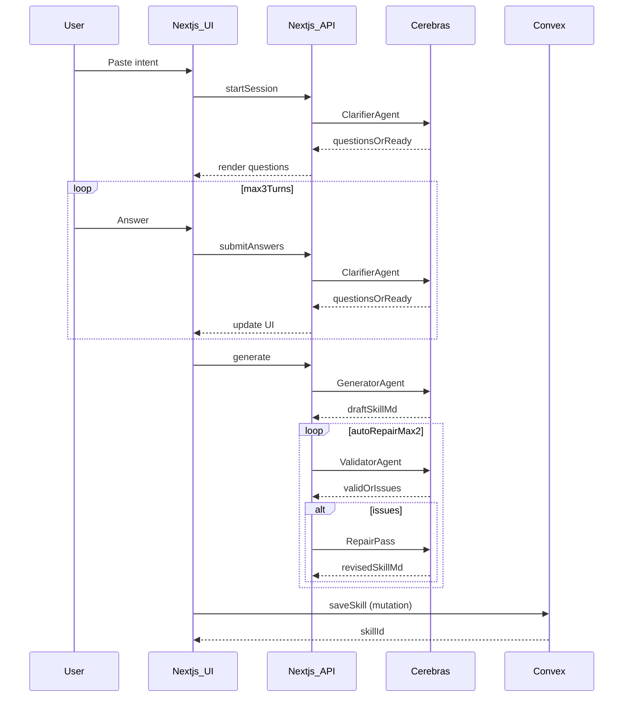

# SkillShift Multi-Agent MVP (Clarify → Generate → Validate) — Updated for Convex+Clerk Auth

## What changed vs prior plan

- **Removed** “set up Clerk” and “add Convex provider” steps (you already have both wired).
- **Auth/UI gating** will use **Convex** components (`Authenticated`, `Unauthenticated`, `AuthLoading`) and **Convex** hook (`useConvexAuth`) instead of Clerk equivalents.
- **Backend ownership/auth** in Convex functions will use `await ctx.auth.getUserIdentity()`.
- **Cerebras provider** will use your existing `lib/cerebras.ts` (`cerebrasProvider`).

## Verified existing setup in your repo

- `app/layout.tsx` already wraps the app in `ConvexClientProvider`.
- `components/ConvexClientProvider.tsx` uses `ConvexProviderWithClerk`.
- `proxy.ts` is already set to run `clerkMiddleware()` for routes and APIs.
- `lib/cerebras.ts` defines `cerebrasProvider = createCerebras({ apiKey: process.env.CEREBRAS_API_KEY ?? '' })`.

## MVP goal

Implement a **3-agent pipeline**:

- **Clarifier agent** (multi-round, max **3** turns): asks the user for missing context
- **Generator agent**: generates a valid **Agent Skills `SKILL.md`** (frontmatter + Markdown body)
- **Validator agent**: validates that the generated skill matches the user’s prompt + Q&A and follows the Agent Skills spec; on failure, **auto-repair** and re-validate

Output is:

- **Markdown `SKILL.md`** shown in UI + copy button
- Option to **save** the final skill to Convex (per user)

## Architecture

## Implementation steps

### 1) Convex schema + functions (new)

Add a real schema and server-side functions for sessions + skills.

- Add `convex/schema.ts` with tables:
- `skillSessions`: store `{ userId, intent, turn, qa: [{q,a}], status, createdAt, updatedAt }`
- `skills`: store `{ userId, name, description, skillMarkdown, sourceIntent, qaSnapshot, createdAt, updatedAt }`
- Add `convex/skills.ts` with queries/mutations:
- `createSession`, `appendAnswers`, `setSessionStatus`
- `createSkill`, `listMine`, `getMine`, `deleteMine`

**Auth in Convex functions**:

- Use `const identity = await ctx.auth.getUserIdentity()`
- If `identity === null`, throw `Not authenticated`
- Use `identity.subject` as the stable owner key (Clerk user id)

### 2) Multi-agent orchestration API routes (new)

Implement API routes that call Cerebras through your provider.

- Files:
- `app/api/skills/session/start/route.ts`
- `app/api/skills/session/answer/route.ts`
- `app/api/skills/generate/route.ts`

**Provider usage**:

- Import `cerebrasProvider` from `lib/cerebras.ts`
- Default model: `cerebrasProvider('llama3.1-8b')`

### 3) UI gated by Convex auth components (replace demo)

Replace `app/page.tsx` demo with a guided flow.

- Use:
- `<Authenticated>` to show the main SkillShift UI
- `<Unauthenticated>` to show `SignInButton` (or your preferred entry point)
- `<AuthLoading>` for skeleton/loading state
- When you need auth readiness, use `useConvexAuth()` (not Clerk’s `useAuth()`).

UI steps:

- Step 1: intent textarea
- Step 2: clarifier Q&A panel (multi-round up to 3)
- Step 3: generated `SKILL.md` preview (copy)
- Step 4: save + My Skills library

Files:

- `app/page.tsx`
- `components/SkillComposer.tsx`
- `components/ClarifierPanel.tsx`
- `components/SkillPreview.tsx`
- `components/SkillLibrary.tsx`

### 4) Validation + repair mechanics

Server-side:

- Add deterministic validation helpers (frontmatter extraction, required keys, slug checks).
- Validator agent checks:
- Agent Skills spec: YAML frontmatter exists and contains `name`, `description`
- Alignment: does not contradict intent/Q&A
- Auto-repair loop:
- up to **2** repair attempts before returning “failed validation” with issues.

## Environment variables

- **Already expected**:
- `NEXT_PUBLIC_CONVEX_URL`
- Clerk keys (already in your setup)
- **Add**:
- `CEREBRAS_API_KEY`

## Out of scope (MVP)

- Downloadable zip skill folders
- Executing scripts / sandboxing
- Skill versioning, org sharing, tags/search

## Todos

- `convex-schema`: Add Convex `schema.ts` + skills/session functions using `ctx.auth.getUserIdentity()`.