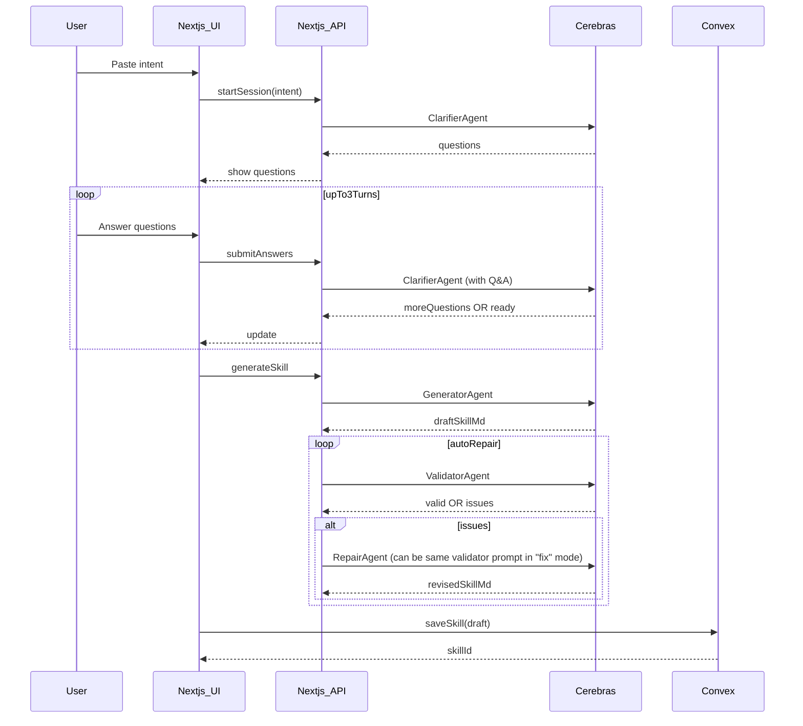

# SkillShift Multi-Agent MVP (Clarify → Generate → Validate)

## Goal

Turn messy product intent into a **valid Agent Skills `SKILL.md`** using a **multi-agent pipeline**:

- **Clarifier agent**: asks for missing context (multi-round, max 3 turns)
- **Generator agent**: produces `SKILL.md` (YAML frontmatter + Markdown body)
- **Validator agent**: validates against (a) Agent Skills spec and (b) the user’s provided context (original prompt + clarifier Q&A); on failure, **auto-repair** and re-validate

## Product scope (MVP)

- Auth: **Clerk** (skills stored per user)
- Persistence: **Convex** (save skill drafts + clarifier sessions)
- Output format: **Markdown** `SKILL.md`
- Model/provider: **Cerebras** via `@ai-sdk/cerebras`, default model **`llama3.1-8b`**

## Repo reality check (what we’ll build on)

- App currently shows a demo component (`app/page.tsx` → `components/component-example.tsx`).
- Convex is installed but there is **no schema or functions yet** (`convex/_generated/dataModel.d.ts` indicates missing `schema.ts`).
- No existing AI SDK or Convex React wiring found in `app/` or `components/`.

## Architecture

### Data flow

### Agent roles (prompt-level contracts)

- **Clarifier agent**
- Input: user intent + prior Q&A
- Output: either `{"status":"need_more_info","questions":[...]} `or `{"status":"ready"}`
- Guardrails: ask only what’s necessary; prefer multiple-choice when possible
- **Generator agent**
- Input: intent + Q&A
- Output: `SKILL.md` with **required YAML frontmatter** (`name`, `description`) + Markdown instructions
- **Validator agent**
- Input: intent + Q&A + candidate `SKILL.md`
- Output: `{"valid":true}` OR `{"valid":false,"issues":[...],"fix_suggestion":...}`
- Checks:
    - Agent Skills spec: YAML frontmatter present; `name`/`description` exist; naming conventions
    - Alignment: skill doesn’t contradict user intent/Q&A
- On failure: triggers repair pass and re-validates

## Implementation steps

### 1) Auth (Clerk)

- Add Clerk integration for user identity.
- Files:
- `middleware.ts`
- `app/layout.tsx`
- `app/sign-in/[[...sign-in]]/page.tsx`
- `app/sign-up/[[...sign-up]]/page.tsx`
- Env:
- `NEXT_PUBLIC_CLERK_PUBLISHABLE_KEY`, `CLERK_SECRET_KEY`

### 2) Convex schema + tables

- Add `convex/schema.ts` with tables:
- `skillSessions`: `{ userId, intent, turn, qa: [{q,a}], status, createdAt, updatedAt }`
- `skills`: `{ userId, name, description, skillMarkdown, sourceIntent, qaSnapshot, createdAt, updatedAt }`
- Add `convex/skills.ts` queries/mutations:
- `createSession`, `appendAnswers`, `setSessionStatus`
- `createSkill`, `listMine`, `getMine`, `deleteMine`

### 3) Convex React provider wiring

- Add client provider wrapper and hook up `NEXT_PUBLIC_CONVEX_URL`.
- Files:
- `app/providers.tsx` (new)
- `app/layout.tsx` (wrap children)

### 4) API routes for multi-agent orchestration (Next.js)

Implement endpoints (server-side) that call Cerebras via AI SDK:

- `POST /api/skills/session/start` → run ClarifierAgent turn 1
- `POST /api/skills/session/answer` → append answers, run ClarifierAgent again
- `POST /api/skills/generate` → run GeneratorAgent, then Validator/Repair loop

Provider details:

- Use `@ai-sdk/cerebras` and `CEREBRAS_API_KEY`
- Default model: `llama3.1-8b`

### 5) UI flow (shadcn)

use existing elements in componenets/ai-elements when possibleReplace demo UI with a guided experience

- Step 1: Paste intent
- Step 2: Clarifier chat-style Q&A (multi-round up to 3)
- Step 3: Show generated `SKILL.md` + validation status + copy button
- Step 4: Save to Convex and show in **My Skills** list

Files:

- `app/page.tsx`
- `components/SkillComposer.tsx` (intent input)
- `components/ClarifierPanel.tsx` (questions + answers)
- `components/SkillPreview.tsx` (markdown + copy)
- `components/SkillLibrary.tsx` (list/detail)

### 6) Validation + repair mechanics

- Add deterministic checks on the server in addition to LLM validation:
- frontmatter extraction
- required keys present
- slug-safe `name`
- Validator agent also checks alignment with user Q&A.
- Auto-repair attempts: start with **2 repair attempts** (configurable).

## Out of scope (MVP)

- Downloading full skill folders/zip
- Executing bundled scripts / sandboxing
- Skill versioning, tags, org/team sharing

## Todos

- `auth-clerk`: Add Clerk auth scaffolding.
- `convex-schema`: Create schema + session/skills tables + functions.
- `convex-client`: Add Convex provider wiring.