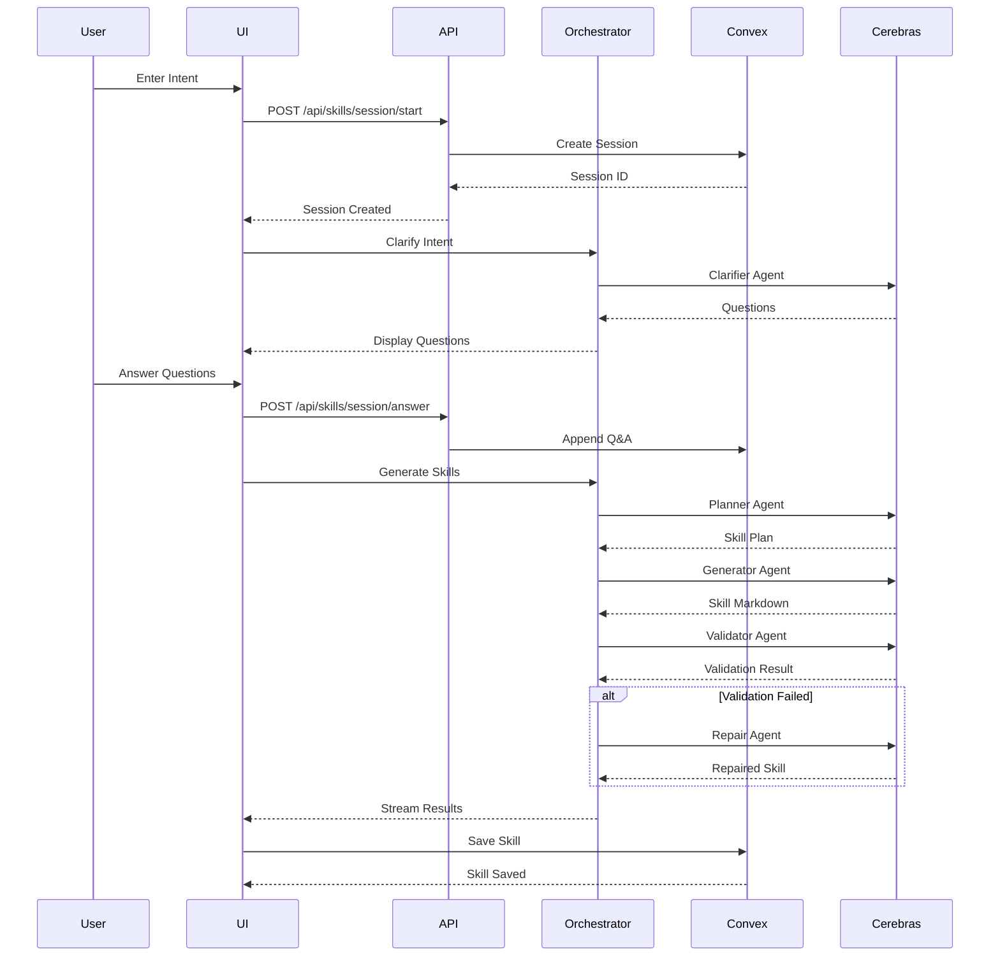
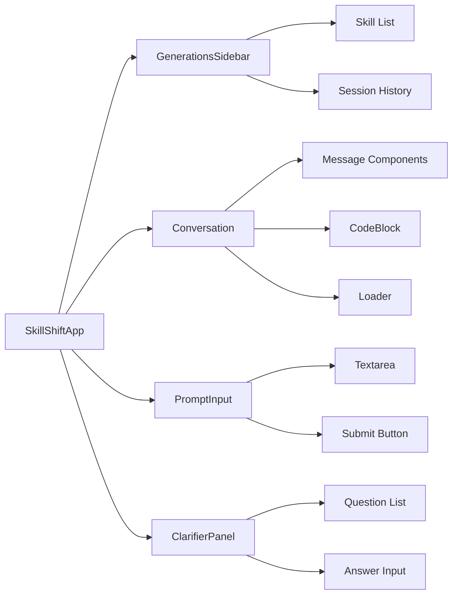

# SkillShift

SkillShift is an AI-powered application that generates structured learning skills through an intelligent conversation flow. The system uses a multi-agent orchestration approach to clarify user intent, plan skill breakdowns, generate content, validate output, and repair issues automatically.

## About the Project

SkillShift helps users create well-structured learning skills by:
- **Interactive Clarification**: Asks targeted questions to understand user intent
- **Intelligent Planning**: Breaks down complex requests into multiple focused skills
- **AI-Powered Generation**: Creates markdown-formatted skill content using Cerebras AI
- **Automatic Validation**: Validates generated skills for structure and quality
- **Self-Repair**: Automatically fixes validation issues when possible
- **Session Management**: Tracks conversation history and generated skills

## Tech Stack

### Frontend
- **Next.js 16** - React framework with App Router
- **React 19** - UI library
- **TypeScript** - Type safety
- **Tailwind CSS 4** - Styling
- **shadcn/ui** - Component library built on Radix UI
- **TipTap** - Rich text/markdown editor
- **React Flow (xyflow)** - Flow diagram visualization
- **Framer Motion** - Animations

### Backend & Database
- **Convex** - Backend-as-a-Service with real-time database
- **Next.js API Routes** - Server-side API endpoints

### Authentication
- **Clerk** - User authentication and management

### AI/ML
- **Vercel AI SDK** - AI integration framework
- **Cerebras AI** - LLM provider for skill generation
- **Zod** - Schema validation

### Other Libraries
- **Shiki** - Syntax highlighting for code blocks
- **nanoid** - Unique ID generation
- **streamdown** - Streaming utilities

## Architecture

### System Architecture

```mermaid
graph TB
    subgraph "Client Layer"
        A[Next.js App Router] --> B[Landing Page]
        A --> C[SkillShiftApp]
        C --> D[Prompt Input]
        C --> E[Conversation UI]
        C --> F[Generations Sidebar]
        C --> G[Clarifier Panel]
        C --> H[Markdown Editor]
    end

    subgraph "Authentication"
        I[Clerk Auth] --> A
        I --> J[User Identity]
    end

    subgraph "API Layer"
        K[Next.js API Routes]
        K --> L[/api/skills/generate]
        K --> M[/api/skills/session/start]
        K --> N[/api/skills/session/answer]
    end

    subgraph "Agent Orchestrator"
        O[Orchestrator] --> P[Planner Agent]
        O --> Q[Clarifier Agent]
        O --> R[Generator Agent]
        O --> S[Validator Agent]
        O --> T[Repair Agent]
        P --> U[Cerebras AI]
        Q --> U
        R --> U
        S --> U
        T --> U
    end

    subgraph "Data Layer"
        V[Convex Backend]
        V --> W[skillSessions Table]
        V --> X[skills Table]
        V --> Y[Queries]
        V --> Z[Mutations]
    end

    A --> I
    C --> K
    L --> O
    M --> V
    N --> V
    O --> V
    V --> J

    style A fill:#0070f3
    style O fill:#ff6b6b
    style V fill:#00d4aa
    style U fill:#9b59b6
    style I fill:#6366f1
```

### Data Flow



### Component Structure



## Getting Started

### Prerequisites

- Node.js 18+ 
- pnpm (or npm/yarn)
- Convex account
- Clerk account
- Cerebras API key

### Installation

1. Clone the repository:
```bash
git clone <repository-url>
cd skillshift
```

2. Install dependencies:
```bash
pnpm install
```

3. Set up environment variables:
Create a `.env.local` file with:
```env
NEXT_PUBLIC_CLERK_PUBLISHABLE_KEY=your_clerk_key
CLERK_SECRET_KEY=your_clerk_secret
CONVEX_DEPLOYMENT=your_convex_url
CEREBRAS_API_KEY=your_cerebras_key
CEREBRAS_MODEL=zai-glm-4.7
```

4. Set up Convex:
```bash
npx convex dev
```

5. Run the development server:
```bash
pnpm dev
```

Open [http://localhost:3000](http://localhost:3000) with your browser to see the result.

## Project Structure

```
skillshift/
├── app/                    # Next.js App Router
│   ├── api/               # API routes
│   │   └── skills/        # Skill generation endpoints
│   ├── layout.tsx         # Root layout
│   └── page.tsx           # Main page
├── components/            # React components
│   ├── ai-elements/      # AI conversation components
│   ├── ui/               # shadcn/ui components
│   ├── SkillShiftApp.tsx # Main app component
│   ├── GenerationsSidebar.tsx
│   ├── ClarifierPanel.tsx
│   └── MarkdownEditor.tsx
├── convex/               # Convex backend
│   ├── schema.ts         # Database schema
│   ├── sessions.ts       # Session mutations/queries
│   └── skills.ts         # Skill mutations/queries
├── lib/                  # Utility libraries
│   ├── agents/           # AI agent orchestration
│   │   ├── orchestrator.ts
│   │   ├── prompts.ts
│   │   ├── types.ts
│   │   └── validation.ts
│   ├── cerebras.ts       # Cerebras AI provider
│   └── utils.ts          # Utility functions
└── public/               # Static assets
```

## Features

- **Multi-Agent System**: Specialized AI agents for planning, clarification, generation, validation, and repair
- **Real-time Streaming**: Live updates as skills are generated
- **Session Management**: Track conversation history and skill generation sessions
- **Markdown Editor**: Edit and preview generated skills
- **Code Highlighting**: Syntax highlighting for code blocks in skills
- **Responsive UI**: Modern, accessible interface built with shadcn/ui

## Learn More

- [Next.js Documentation](https://nextjs.org/docs)
- [Convex Documentation](https://docs.convex.dev)
- [Clerk Documentation](https://clerk.com/docs)
- [Vercel AI SDK](https://sdk.vercel.ai/docs)

## Deploy

The easiest way to deploy SkillShift is using the [Vercel Platform](https://vercel.com/new):

1. Push your code to GitHub
2. Import your repository to Vercel
3. Configure environment variables
4. Deploy!

Make sure to also deploy your Convex backend separately.
